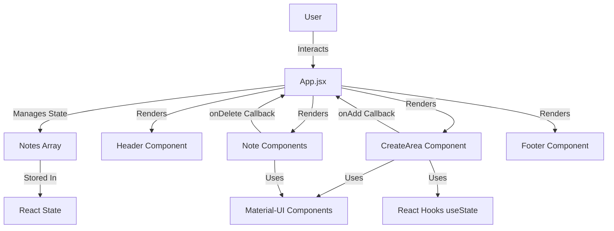

# Keeper - Note Taking App

A modern, interactive note-taking application built with React and Material-UI. Keeper provides a clean and intuitive interface for quickly creating, viewing, and managing your notes.

## 🌐 Live Demo

**Try it out:** [https://keeper-app-v1.vercel.app/](https://keeper-app-v1.vercel.app/)

## 🎯 Problem Solved

In today's fast-paced digital world, people need a quick and efficient way to capture thoughts, ideas, and reminders without the complexity of heavy note-taking applications. Keeper solves this by providing:

- **Instant Note Capture**: Quickly jot down notes without navigating through complex interfaces
- **Zero Friction**: Minimal UI that expands only when needed, keeping the interface clean and distraction-free
- **Local-First Approach**: All notes stored in browser memory for instant access without network dependencies
- **Simple Management**: Easy creation and deletion of notes without overwhelming features

## 🏗️ Architecture



### Component Hierarchy

```
App.jsx (Root Component)
├── Header.jsx (App Header with Logo)
├── CreateArea.jsx (Note Creation Form)
│   └── Material-UI Fab & Zoom Components
├── Note.jsx (Individual Note Cards)
│   └── Material-UI Icons
└── Footer.jsx (App Footer)
```

## 🛠️ Tech Stack

### Core Framework
- **React** 19.2.0 - Modern UI library for building interactive user interfaces
- **React DOM** 19.2.0 - React renderer for web applications

### Build Tools
- **Vite** (rolldown-vite 7.2.5) - Next-generation frontend build tool for fast development and optimized production builds
- **@vitejs/plugin-react** - Vite plugin for React support

### UI Components & Styling
- **Material-UI (MUI)** 7.3.6 - Comprehensive React component library
  - `@mui/material` - Core Material-UI components
  - `@mui/icons-material` - Material Design icons
- **Emotion** - CSS-in-JS library for styling
  - `@emotion/react` 11.14.0
  - `@emotion/styled` 11.14.1

### Code Quality
- **ESLint** 9.39.1 - JavaScript linter for code quality
- **TypeScript Types** - Type definitions for React and React DOM

## 📊 Metrics

### Performance
- **Build Time**: Optimized with Vite's fast build system
- **Bundle Size**: Lightweight application with minimal dependencies
- **Initial Load**: Fast due to Vite's optimized development server
- **Runtime**: Efficient React 19 rendering with hooks-based state management

### Code Quality
- **Components**: 5 modular, reusable React components
- **State Management**: Simple and efficient using React hooks (useState)
- **Code Organization**: Clean separation of concerns with component-based architecture

### User Experience
- **Interaction**: Instant note creation and deletion
- **UI Responsiveness**: Material-UI components provide smooth animations and transitions
- **Accessibility**: Material-UI components include built-in accessibility features

## ✨ Features

- ✨ **Create Notes**: Add notes with titles and content
- 🗑️ **Delete Notes**: Remove notes you no longer need
- 🎨 **Material-UI Design**: Beautiful, modern interface using Material-UI components
- 📱 **Responsive**: Works seamlessly across different screen sizes
- ⚡ **Fast**: Built with Vite for lightning-fast development and builds
- 🎯 **Expandable Input**: Note creation area expands when clicked for better UX

## 🚀 Getting Started

### Prerequisites

- Node.js (v14 or higher)
- npm or yarn

### Installation

1. Clone the repository:
```bash
git clone https://github.com/patelkev/keeper.git
cd keeper
```

2. Install dependencies:
```bash
npm install
```

3. Start the development server:
```bash
npm run dev
```

4. Open your browser and navigate to `http://localhost:5173` (or the port shown in your terminal)

## 📜 Available Scripts

- `npm run dev` - Start the development server
- `npm run build` - Build the app for production
- `npm run preview` - Preview the production build locally
- `npm run lint` - Run ESLint to check code quality

## 📁 Project Structure

```
keeper/
├── public/
│   └── note-icon.svg          # App icon
├── src/
│   ├── components/
│   │   ├── CreateArea.jsx     # Note creation form with expandable input
│   │   ├── Header.jsx         # App header with logo
│   │   ├── Note.jsx           # Individual note card component
│   │   └── Footer.jsx         # App footer
│   ├── styles/
│   │   └── index.css          # Global styles
│   ├── App.jsx                # Main app component with state management
│   └── main.jsx               # Application entry point
├── package.json               # Dependencies and scripts
├── vite.config.js            # Vite configuration
└── README.md                  # Project documentation
```

## 💻 Usage

1. **Creating a Note**: 
   - Click on the "Take a note..." textarea
   - The input area will expand to show title and content fields
   - Enter a title (optional) and content
   - Click the "+" button to add the note

2. **Deleting a Note**:
   - Click the delete button on any note card to remove it

## 🤝 Contributing

Contributions are welcome! Please feel free to submit a Pull Request.

## 👤 Author

**Kevin Patel**

---

Built with ❤️ using React and Material-UI
