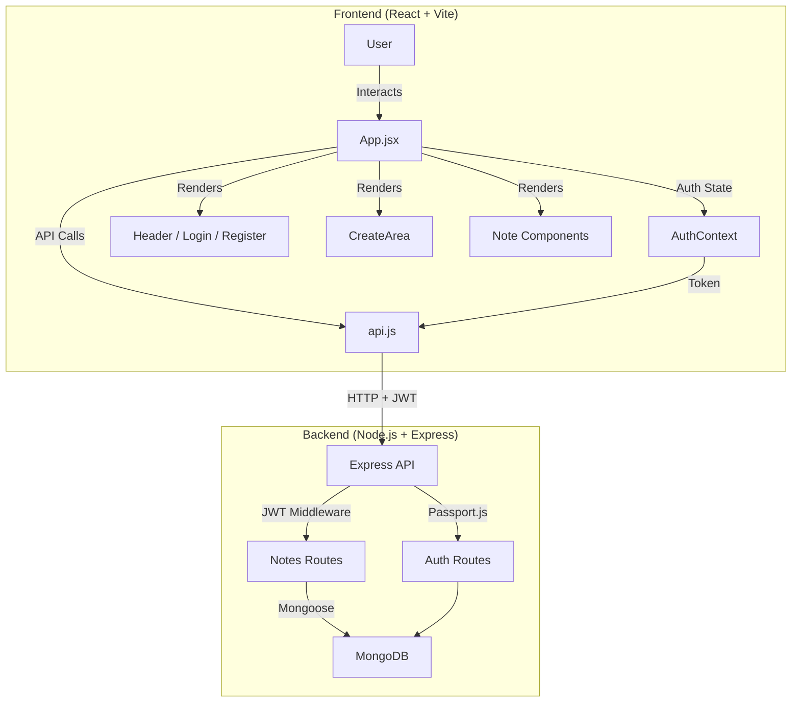

# Keeper - Note Taking App

A full-stack note-taking application with user authentication and persistent storage. The frontend is built with React and Material-UI; the backend uses Node.js, Express, MongoDB, and Passport.js for a complete, production-ready experience.

## 🌐 Live Demo

**Try it out:** [https://keeper-app-v1.vercel.app/](https://keeper-app-v1.vercel.app/)

## 🎯 Problem Solved

In today's fast-paced digital world, people need a quick and reliable way to capture thoughts, ideas, and reminders—with their data saved securely. Keeper provides:

- **User Accounts**: Register and log in so your notes are private and persistent
- **Instant Note Capture**: Create notes with minimal friction; the UI expands only when needed
- **Persistent Storage**: Notes are stored in MongoDB and synced across sessions
- **Simple Management**: Create and delete notes with a clean, distraction-free interface

## 🏗️ Architecture

Keeper is a full-stack application: a React frontend talks to a REST API, which uses MongoDB for storage and Passport.js (JWT) for authentication.



### Frontend Component Hierarchy

```
App.jsx (Root)
├── AuthProvider (context)
├── Header.jsx (Logo, user, logout)
├── Login.jsx / Register.jsx (when not authenticated)
├── CreateArea.jsx (when authenticated)
├── Note.jsx (list of notes)
└── Footer.jsx
```

### Backend Structure

```
server/
├── src/
│   ├── config/      # database, passport, env
│   ├── models/      # User, Note (Mongoose)
│   ├── routes/      # auth, notes (API)
│   ├── middleware/  # JWT auth
│   └── server.js    # Express app
└── .env             # MONGODB_URI, JWT_SECRET, etc.
```

## 🛠️ Tech Stack

### Frontend
- **React** 19.x – UI library
- **Vite** (rolldown-vite) – Build tool and dev server
- **Material-UI (MUI)** 7.x – Components and icons
- **Emotion** – Styling

### Backend
- **Node.js** – Runtime
- **Express.js** – Web framework and REST API
- **MongoDB** – Database (local or Atlas)
- **Mongoose** – ODM for MongoDB
- **Passport.js** – Authentication (local + JWT strategies)
- **JWT** – Stateless auth tokens
- **bcryptjs** – Password hashing

### Code Quality
- **ESLint** – Linting
- **express-validator** – Request validation on the API

## ✨ Features

- **User Authentication**: Register and log in with email/password (Passport.js + JWT)
- **Create Notes**: Add notes with optional title and content
- **Delete Notes**: Remove notes; data is persisted in MongoDB
- **Per-User Data**: Each user sees only their own notes
- **Material-UI Design**: Responsive, accessible UI
- **Expandable Input**: Note creation area expands on focus for better UX

## 🚀 Getting Started

### Prerequisites

- **Node.js** (v14 or higher)
- **MongoDB** – [Local](https://www.mongodb.com/try/download/community) or [MongoDB Atlas](https://www.mongodb.com/cloud/atlas) (cloud)

### Quick Start

1. **Clone and install**
   ```bash
   git clone https://github.com/patelkev/keeper.git
   cd keeper
   npm install
   cd server && npm install && cd ..
   ```

2. **Configure the backend**
   - Copy `server/.env.example` to `server/.env`
   - Set `MONGODB_URI`, `JWT_SECRET`, and optionally `PORT` and `FRONTEND_URL`

3. **Run the app**
   - **Terminal 1 – backend:** `cd server && npm run dev` (default: http://localhost:5001)
   - **Terminal 2 – frontend:** `npm run dev` (default: http://localhost:5173)

4. Open http://localhost:5173, register a user, and start adding notes.

For detailed setup (MongoDB Atlas, env vars, troubleshooting), see **[SETUP.md](./SETUP.md)**.

## 📜 Scripts

### Root (frontend)
- `npm run dev` – Start Vite dev server
- `npm run build` – Production build
- `npm run preview` – Preview production build
- `npm run lint` – Run ESLint

### Server (backend)
- `npm run dev` – Start Express with nodemon
- `npm start` – Start Express (production)

## 📁 Project Structure

```
keeper/
├── server/                    # Backend (Node.js + Express)
│   ├── src/
│   │   ├── config/            # database, passport, env
│   │   ├── models/            # User, Note
│   │   ├── routes/            # auth, notes
│   │   ├── middleware/        # auth (JWT)
│   │   └── server.js
│   ├── package.json
│   └── README.md              # API and server setup
├── public/
│   └── note-icon.svg
├── src/
│   ├── components/
│   │   ├── CreateArea.jsx
│   │   ├── Header.jsx
│   │   ├── Note.jsx
│   │   ├── Footer.jsx
│   │   ├── Login.jsx
│   │   └── Register.jsx
│   ├── context/
│   │   └── AuthContext.jsx
│   ├── utils/
│   │   └── api.js             # API client (auth + notes)
│   ├── styles/
│   │   └── index.css
│   ├── App.jsx
│   └── main.jsx
├── package.json
├── vite.config.js
├── SETUP.md                   # Full-stack setup guide
└── README.md
```

## 💻 Usage

1. **Register / Log in**  
   Open the app, use “Register here” or “Login”, and sign in with email and password.

2. **Creating a note**  
   Click “Take a note…”, optionally add a title, type content, and click the “+” button.

3. **Deleting a note**  
   Click the delete (trash) icon on a note card.

## 🤝 Contributing

Contributions are welcome. Please open an issue or submit a Pull Request.

## 👤 Author

**Kevin Patel**

---

Built with ❤️ using React, Material-UI, Node.js, Express, MongoDB, and Passport.js
